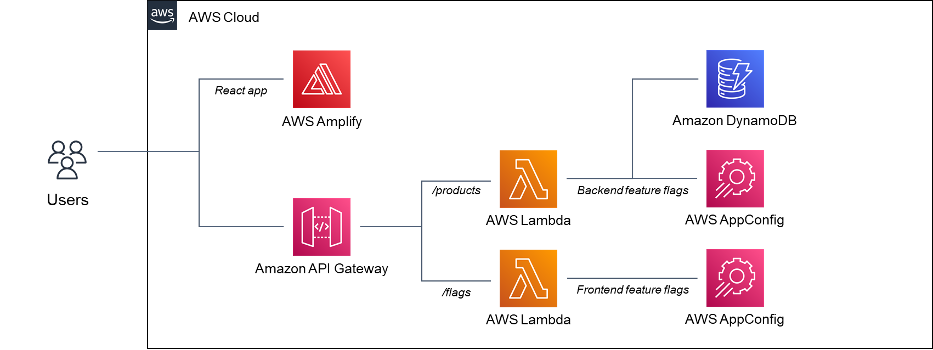
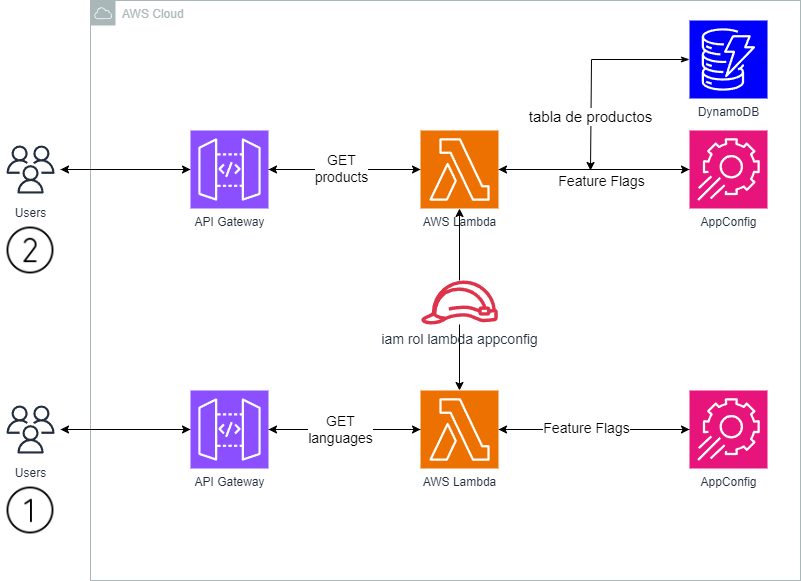
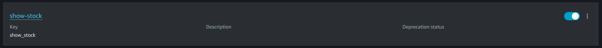
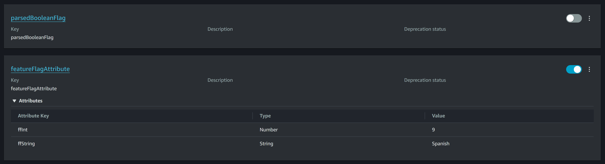
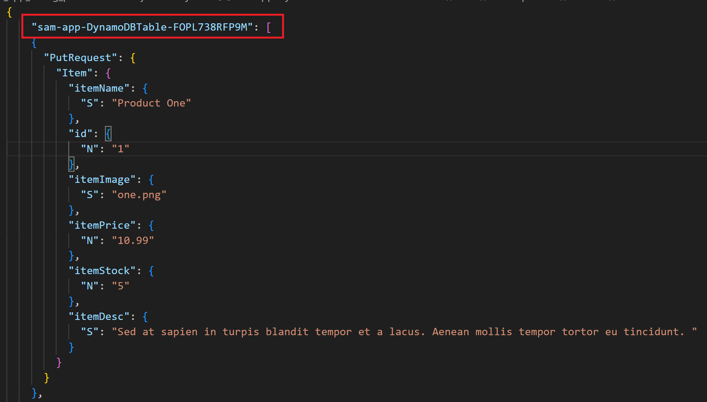

# Feature Flags con AWS AppConfing (Terraform y AWS SAM)

## Objectivo

Diseñar una arquitectura para la implementación de feature flags en infraestructura como código, utilizando Terraform y AWS SAM, ofrece la ventaja de desplegar nuevas implementaciones de manera controlada, mitigando así el riesgo de posibles incidencias en el ambiente productivo. En caso de surgir algún problema, se realizará un RollBack de forma automática. Esto permite afectar únicamente a un grupo específico de usuarios que experimentarán las nuevas funcionalidades, tanto en el frontend como en el backend, de manera progresiva y en intervalos de tiempo definidos.

## Indice

- ✅ [Arquitectura](#arquitectura)
- ✅ [AppConfig](#appconfig)
- ✅ [SAM](#sam)
- ✅ [Despliegue](#despliegue)

#### Arquitectura
Para la siguiente arquitectura, me base en la documentación oficial de AWS, el cual se muestra acontinuación.

Referencia hecha por AWS oficial [enlance](https://aws.amazon.com/es/blogs/mt/introducing-aws-appconfig-feature-flags-in-preview/)
Como inspiración realice la creación de mi propia arquitectura, con la finalidad de evidenciar el funcionamiento y proposito que
brindan [AppConfig](#appconfig) integrando los beneficios de las Feature Flags (Solo para parte del backend).
Aqui abajo se observa la propuesta de la arquictetura con base a las necesidades de la demostración.

Como se visualiza, en el primer ejemplo, los usuarios consumen directamente con el apigateway, el cual se optó por tipo de API HTTP, debido a que es mas barato en cuanto a costo, en comparación a API REST. Ademas, nos ofrece una interfaz que utiliza HTTP como medio de transferencia de datos, sin necesariamente seguir todos los principios REST para esta prueba en espeficico. Si quieres saber mas sobre la diferencias oficiales de aws, consulte el siguiente.
[enlance](https://docs.aws.amazon.com/apigateway/latest/developerguide/http-api-vs-rest.html)
Despues de pasar por el endpoint de la API, esta hace la petición a la funcion lambda atachada previamente configurada en el terraform, es necesario crear primero el  rol con las politicas de lambda y appconfig. 
Dentro del codigo de dicha función, recupera los features flags del AWS AppConfig. Al momento de obtener la respuesta de los atributos del despliegue.
Regresa hasta al punto inicial al cliente, para apreciar los resultados(depende de la estrategia que se escogió para aplicar estos cambios), consulte las diferentes tipos de estrategias que ofrece appConfig en el [enlance](https://docs.aws.amazon.com/appconfig/latest/userguide/appconfig-creating-deployment-strategy.html).
Para el segunda función lambda, tenemos el mismo algoritmo; con la diferencia que al instante de retornar el atributo del feature flag. Se hace uso de una condicional (if), para decidir que columnas de los productos a los clientes. Consulte el sección de [Despliegue](#despliegue) para mas información.
#### AppConfig
AppConfig es un servicio ofrecido por AWS con el fin de centralizar la gestión de los datos de configuración. Le brinda la capacidad de crear, administrar e implementar cambios de configuración separados del código. Esto le ayuda a evitar implementar el servicio repetidamente para realizar pequeños cambios.
AppConfig admite implementaciones controladas en aplicaciones de cualquier tamaño e incluye controles de validación y monitoreo integrados. Puede utilizar AppConfig con aplicaciones alojadas en instancias Amazon EC2, Lambda, contenedores.
Estas son las ventajas de utilizarlo.
1. Gestionar la configuración mediante AWS AppConfig nos permite movernos de forma rápida y segura.
El comportamiento del software puede modificarse rápida o gradualmente sin el peligro de volver a implementar una nueva versión de código al realizar cambios de configuración durante el tiempo de ejecución.
2. Validar la configuración antes de implementar para evitar errores costosos.
AWS AppConfig le permite evitar errores de configuración que podrían causar problemas de cara al cliente o incluso interrupciones. Puede utilizar una función de AWS Lambda para validar los datos de configuración de la aplicación con un esquema, o puede utilizar una función de AWS Lambda para validar los datos con la configuración.
3. Supervise la configuración y retroceda automáticamente si es necesario.
AWS AppConfig admite las mejores prácticas al permitir que los cambios de configuración se apliquen de forma inmediata o gradual. Los clientes pueden elegir un período de tiempo para monitorear el cambio de configuración.
4. Implementar cambios rápidamente en un conjunto de objetivos.
AWS AppConfig facilita la administración de aplicaciones a gran escala al permitirle implementar cambios de configuración desde una única ubicación. AWS AppConfig se puede utilizar con aplicaciones que se ejecutan en Amazon EC2, Lambda, contenedores.
5. Actualización de aplicaciones sin interrupciones.
Durante el tiempo de ejecución, AWS AppConfig comunica las actualizaciones de configuración a sus objetivos. Como consecuencia, no tendrás que pasar por un largo procedimiento de creación.
6. Controle la implementación de cambios en su aplicación.
AWS AppConfig le permite utilizar una estrategia de implementación para reducir el riesgo mientras distribuye los cambios de configuración a sus objetivos. 
Los controles de velocidad de una estrategia de implementación pueden decidir qué tan rápido los objetivos de su aplicación deben recibir una actualización de configuración.
7. Reversión basada en alarmas de CloudWatch.
Configure AWS AppConfig para retroceder a una versión anterior de una configuración en respuesta a una o más alarmas de Amazon CloudWatch. Cuando configura una implementación para responder a las alarmas de CloudWatch.
Consulte para mas información, la referencia de donde se tomo la investigación [enlance](https://medium.com/contino-engineering/what-is-aws-appconfig-174d4f5a79bc)
#### SAM
El AWS Serverless Application Model (AWS SAM) es un conjunto de herramientas que mejora la experiencia de los desarrolladores a la hora de crear y ejecutar aplicaciones sin servidor. AWS AWS SAM ofrece una variedad de beneficios.
1. Defina el código de infraestructura de su aplicación rápidamente, utilizando menos código
Cree AWS SAM plantillas para definir el código de infraestructura de aplicaciones sin servidor. Implemente sus plantillas directamente AWS CloudFormation para aprovisionar sus recursos.
2. Administre las aplicaciones sin servidor durante todo su ciclo de vida de desarrollo
Use la CLI de AWS SAM para administrar su aplicación sin servidor durante las fases de autoría, creación, implementación, prueba y supervisión de su ciclo de vida de desarrollo.
3. Aprovisione rápidamente los permisos entre los recursos con AWS SAM conectores
Usa AWS SAM conectores en tus AWS SAM plantillas para definir los permisos entre tus AWS recursos. AWS SAM transforma tu código en los permisos de IAM necesarios para facilitar tu intención.
4. Sincronice de forma continua los cambios locales en la nube a medida que vaya desarrollando contenido
Utilice el AWS SAMCLI sam sync comando para sincronizar automáticamente los cambios locales con la nube, lo que agiliza los flujos de trabajo de desarrollo y pruebas en la nube.
#### Despliegue

## Requisitos previos
* Instalar terraform(1.7.5)
* Instalar AWS SAM(1.115.0)
* Instalar AWS CLI(2.15.35)
* Verion de runtime 16 de node js para la funcion lambda(productos)
* Verion de runtime 20 de node js para la funcion lambda(lenguajes)
* Crear AppConfig desde la consola de aws, para cada uno de las funciones lambda.

Productos

Lenguajes


La arquitectura se divide en dos partes por separado,pero en ambos para poder desplegar se ejecutan los mismos siguientes pasos. 
Acontinuación, comenzaremos con "backend_app_config_language".
1. Ejecute los siguientes comandos para cambiar al directorio backend e instalar dependencias.
```
cd backend_app_config_language
npm install
```
2. Crear un comprimido(.zip) de todos los archivos con el mismo nombre la carpeta raiz (solo aplica si usas terraform para desplegar).
En caso de especificar otro nombre, en el archivo terraform.tfvars, 
en la variable "dir_files_zip" indicar la dirección en donde se dicho empaquetado,
por ejemplo; "./backend_app_config_language.zip"
3. Agregar los valores de las demás variables en el archivo que anteriormente se mencionó (terraform.tfvars se tiene que crear el archivo, en caso de desplegar con terraform).
4. Ahora se procede a desplegar, ya sea por terraform o por AWS SAM. 
* El mas sencillo es "SAM" veamos los comandos a ejecutar.
```
sam build
```
```
sam deploy -g 
```
(este es la guia que permite agregar el valor de los argumentos necesarios para appconfig(AppConfigApplication,AppConfigEnvironment,AppConfigConfigurationProfile) de las variables de entorno por consola o bien modificar el archivo "samconfig.toml" en la parte de "parameter_overrides")
* Ahora para terraform, se necesita de los siguientes comandos.
 inicializa un directorio de trabajo de Terraform, descargando los proveedores necesarios y configurando el entorno de trabajo. Verificar el archivo main.tf, para observar la version de terraform y del proveedor AWS que se va utilizar en caso de cambiarlo, hacerlo siempre comprobando compatibilidad de la sintanxis del codigo de los modulos (cuidado con esto, se tendra que refactorizar en caso de ser requerido).
```
terraform init
```
```
terraform plan
```
```
terraform apply
```
Pasando por "backend_app_config_products", se tiene mismos pasos previos. Con algunas excepciones, en el paso 2, cambiar los valores de  "dir_files_zip",
por ejemplo; "./backend_app_config_products.zip".
Termiando el paso 4, si desplegaste la infraestructura mediante SAM, al final se necesita ejecutar el siguiente comando posicionando en la carpeta "backend_app_config_products",
pero antes necesitas modificar el archivo "dynamodb.json", cambiar valor de la llave del array, con el nombre de la tabla creado de dynamodb(se muestra en el output - DynamoDBTableName),
Como se muestra en esta imagen.

Una vez hecho las modificaciones previamente, ejecutar el siguiente script.
```
aws dynamodb batch-write-item --request-items file://dynamodb.json
```